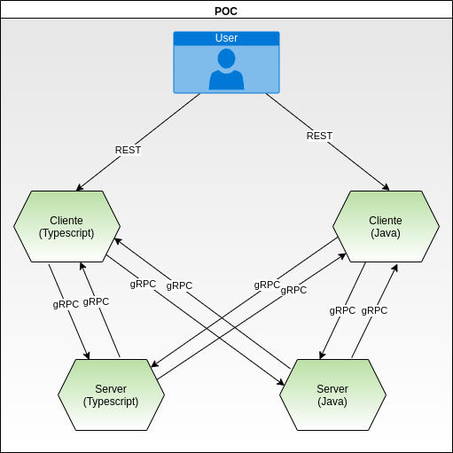

## Comunicação usando gRPC ###

### O que é gRPC?

É um framework de comunicação entre serviços criado pela Google para aumentar a performace na comunicação entre os microservices.
A arquitetura gRPC usa o formato de mensagem protobuf (buffers de protocolo), que é altamente compactado e eficiente para serializar dados estruturados.

As APIs baseadas em RPC são ótimas para ações (ou seja, procedimentos ou comandos) e pode servir como uma alternativa mais eficiente do que uma API REST.


### Vantagens

- HTTP/2 - Estrutura leve e de alto desempenho;
- Protocol Buffers por padrão;
- Multi plataforma usando mesma interface de contratos;
- Recursos disponíveis para várias linguagens;
- Oferece suporte a chamadas streaming do client, server e - bidirecionais;
- Redução do uso de rede através da serialização do Protobuf;
- Contrato definido entre cliente e server; 

### Desvantagens

- Pouca documentação; 
- Suporte limitado ao navegador;

## POCS

Foi desenvolvido duas POCS, uma em Typescript (client e server) em outra em Java (client e server) para testar a comuniação entre os serviços usando gRPC. Abaixo como essa comunicação deve ocorrer.



### Typescript

#### Detalhes de Implementação

Quando trabalhamos com gRPC temos um arquivo .proto, que nada mais é do que o contrato que iremos usar na comunicação entre os microservices.

Como essa POC é em Typescript precisamos ter arquivos .ts e .js para que possamos usar as definições do contrato (arquivo .proto), para isso é necessario realizar os passos abaixo.

- Passo 1: No diretório /infra/scripts-node rodar no terminal comando
```
node install
```
- Passo 2: No diretório /infra/scripts-node rodar no terminal comando
```
./protoc.sh 
```

Com esses comandos podemos notar que no diretório /infra/protobuf foi gerado alguns arquivos .ts e .js.

Após feito isso voltar para raiz do projetos (client e server) e rodar para instalar as dependências: 
```
node install
```

#### Ponto Importante: 
- Sempre que for gerado um novo metodo no serviço do protobuf esse script tem que ser rodado, porque somente assim os arquivos (.ts e .js) serão atualizados.

### Java

Em desenvolvimento


## Observações

- O arquivo .proto está na infra para que possa ser usado tantos pelos clientes quanto pelos servers. Pois assim validamos o contrato definido entre os clientes e servidores. Em caso de uso em produção, provavelmente ele estaria em um repositório separado.

## Referências ##

- [gRPC](https://grpc.io/)
- [Protocol Buffers](https://developers.google.com/protocol-buffers/docs/proto)
- [Video 1](https://www.youtube.com/watch?v=QyyMjF764mo&t=2757s)
- [Video 2](https://www.youtube.com/watch?v=lU7OrUeaqD0)